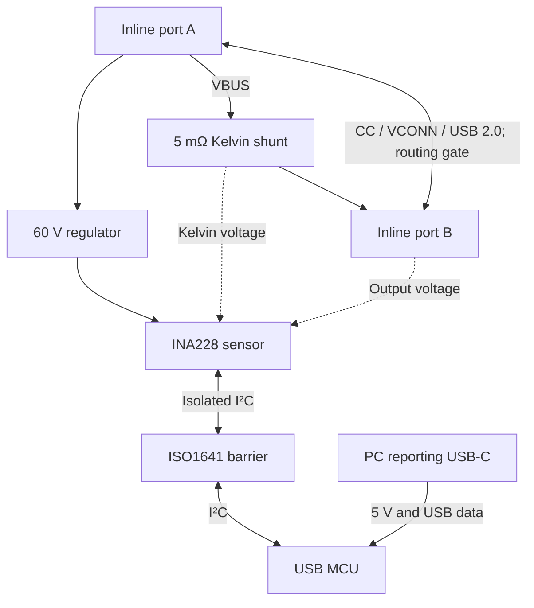

# Preliminary architecture

2026-09-10 — planning design, not a fabrication release.

## Two power domains and a passive main path

Inline ground and appropriate inline shielding continue between A and B. The PC ground, PC shield network, supply, and USB data remain on their own island. The diagram omits the unresolved fault-disconnect circuit and is not a pin-level wiring prescription.

## Charging and data path

| Signal group | Design intent | Required proof |
|---|---|---|
| VBUS contacts | Parallel rated power contacts into wide copper, through the shunt, to output contacts | Current sharing, contact rise, drop, overload behavior |
| GND contacts | Continuous low-resistance return; no sensing shunt | Return-path resistance; no reporting ground connection |
| CC/VCONN contacts | Preserve endpoint and original-cable signaling without added PD terminations | All orientations, attach/detach, e-marker discovery, VCONN and power-role changes |
| D+/D− | DC-coupled USB 2.0 differential path, no MCU tap, no charger-identification resistors | USB 2.0 data plus analog charging signatures; correct handling of duplicated receptacle pins |
| SBU | Keep as individually accessible routing candidates on the feasibility fixture | Determine whether any target charger/device needs them; no unexplained short or termination |
| SuperSpeed contacts | High-speed data/video outside required scope | Establish whether dropping these contacts affects target charging; reserve the option to retain continuity |
| Shields | Inline shields stay in the inline domain | Enclosure, screws, test points, and PC receptacle shell must not bridge the isolation barrier |

Manufacturer precedent exists for passive observation: Infineon's [CY4500](https://www.infineon.com/evaluation-board/CY4500) passes power and signal traffic while observing CC. It is an older, discontinued reference, not evidence that our topology supports EPR, 6 A, or every OEM.

Favor a short custom pigtail with explicitly documented contact continuity. Do not select a stock USB 2.0 cable solely because it is thick or advertised for high power. Its internal e-marker and VCONN wiring can change the circuit we are trying to observe. Keep both inline connector outcomes open through the first coupon.

## Measurement circuit candidate

| Block | Candidate | Design purpose |
|---|---|---|
| U1 | TI INA228, DGS 10-pin | High-side shunt and bus-voltage conversion |
| R1 | Vishay WSK2512, 5 mΩ, 0.5% grade; candidate code WSK25125L000DEA | Four-terminal sense resistor; actual orderable suffix/stock to verify |
| U2 | TI ISO1641BD, SOIC-8 | Bidirectional SDA, PC-to-sensor SCL |
| U3 | ST STM32F042K6T6, LQFP-32 candidate | USB device, I²C master, calibration, timing, reporting |
| U4 | TI TPS7A1601, adjustable 3.3 V | Inline-side low-current supply |
| U5 | 3.3 V PC-side LDO, part open | MCU and isolator PC side |
| J_A / J_B | Connector/pigtail assembly open | This is the primary procurement gate |

INA228 input limits and resolution come from its [datasheet](https://www.ti.com/lit/ds/symlink/ina228.pdf). The [WSK2512 specification](https://www.vishay.com/docs/30108/wsk2512.pdf) supports the four-terminal 5 mΩ candidate; use the **35 ppm/°C finished-part TCR**, not the lower resistive-alloy headline. Calibrate after assembly because a 0.5% nominal shunt is not a 0.1% calibrated system.

Provisional U1 nets, subject to schematic review:

| U1 pin | Net/function |
|---|---|
| 10 IN+ | Upstream shunt Kelvin sense through symmetric input filter |
| 9 IN− | Downstream shunt Kelvin sense through symmetric input filter |
| 8 VBUS | Output-side PCB voltage sense |
| 7 GND | Quiet reference at output-side PCB ground sense point |
| 6 VS | 3V3_INLINE; local decoupling |
| 5 SCL / 4 SDA | Isolator side 2 with local pull-ups |
| 3 ALERT | Inline test pad; poll status initially, no direct PC wire |
| 1 A1 / 2 A0 | Local ground; candidate I²C address 0x40 |

Start input-filter evaluation at two matched 10 Ω sense resistors and 100 nF differential capacitance. This is about 79.6 kHz differential RC bandwidth before ADC filtering. Check transient behavior and any gain correction from loading; calibration and the layout residual budget include this network. Keep Kelvin traces away from power-current constrictions. Choose voltage-rated capacitors and protection from the eventual fault envelope, not normal differential voltage alone.

Use raw shunt voltage and bus voltage for signed calculations: current = calibrated shunt voltage / calibrated resistance; power = current × calibrated bus voltage. This keeps the reference plane explicit and avoids mistaking an IC full-scale error specification for percent-of-reading accuracy. Treat the on-chip power/energy registers as optional cross-checks until signed behavior, scale, and timebase are reviewed.

## Isolation and self-consumption

[ISO1641](https://www.ti.com/lit/ds/symlink/iso1641.pdf) is the provisional barrier. Side 1 faces the PC MCU; side 2 faces U1. Both sides use their own 3.3 V rail and pull-ups. Check the MCU's I²C input-low limit against the isolator's offset output-low level. Start at 100 kHz. Validate hot-plug and unpowered states.

Power U1 and isolator side 2 from an **A-side tap before the shunt** through the [TPS7A16 regulator](https://www.ti.com/lit/ds/symlink/tps7a16.pdf). PC VBUS powers U3, U5, and isolator side 1. Independent local supplies provide supply isolation without a transformer. Budget 8 mA inline draw initially, or 224 mW at 28 V. This is a conservative allocation including bus activity, not a measured consumption figure. Heat and source perturbation remain validation items.

In the normal A-to-B direction, the A-side supply tap is excluded from the shunt reading. Output-voltage sensing and output-side leakage still contribute a small measured burden and are included in the low-power error model. With reverse current, the meter supply becomes part of what the B-side source delivers toward A. Report signed power at the fixed B measurement plane; do not relabel it as pure external-load power in both directions. If symmetric external-load accounting becomes mandatory, reconsider isolated PC-fed sensing or separately measure self-consumption.

Place the PC receptacle on the long edge with a physically separate ground area. Start with a 4 mm PCB barrier keepout as a layout allocation, then verify package, board, pollution assumptions, and test voltage. Isolation here is for the low-voltage measurement application; a component's kV withstand rating is not an instrument mains rating. A system can also connect the two domains externally—for example when the same laptop is both load and reporting host.

## Reference plane and mechanics

The primary reported voltage is at the B-side PCB sense pads. A 100 mm captive cable is an initial mechanical allowance, not a required length. Its resistance lies beyond that plane. Do not silently estimate laptop-terminal power from those pads: either label the plane clearly, add remote Kelvin sense conductors, or qualify a correction and its uncertainty.

Start the PCB floorplan around 55 × 28 mm, four layers with ample outer-layer copper, and revise after connector, isolation, and protection decisions. Put power entry, shunt, and exit in a short direct path; place the sensor near the shunt and the MCU on the reporting edge. Keep hot contacts and the supply regulator away from Kelvin junctions. Final width, copper weights, necks, and vias must follow the resistance and temperature-rise budget. Mechanical strain relief must carry pigtail loads independently of solder pads.

## Remaining circuit gates

No completed connector pin map, ESD/TVS network, current cutout, pigtail procurement specification, or PCB layout is claimed. Resolve D01–D03, measurement-plane requirements, and accuracy/noise qualification before a final schematic. The measurement core can be evaluated separately on a current-limited bench supply while these gates remain open.
