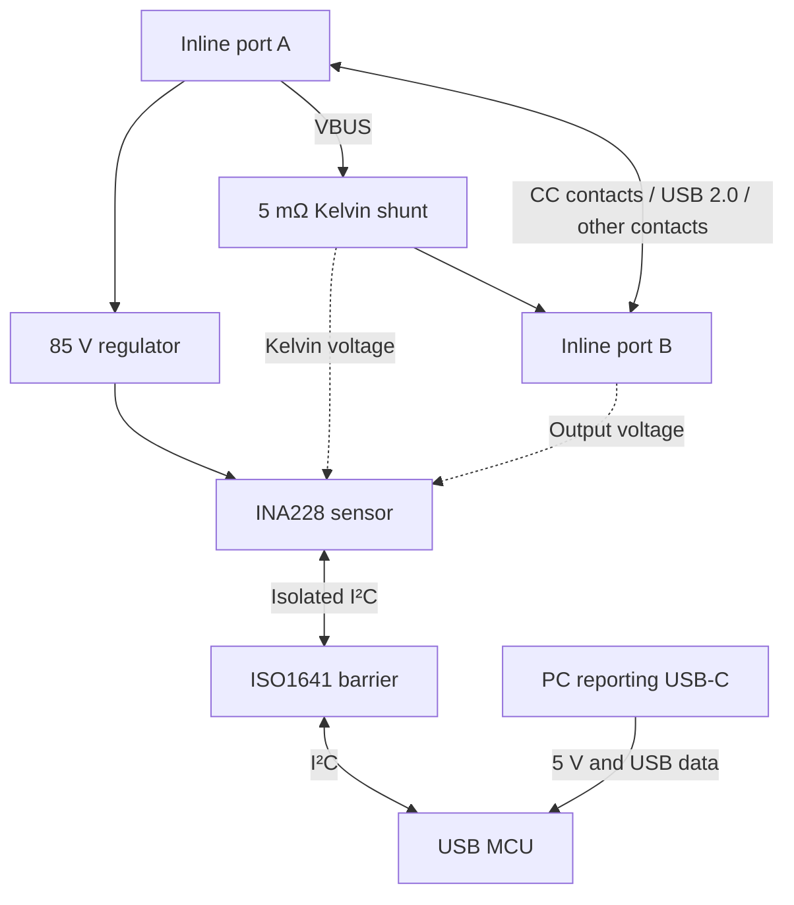

# Bench architecture

2026-09-10 — [bench A schematic and routed PCB](../hardware/bench-rev-a/README.md), not a fabrication release.

## Two power domains and a passive main path

Inline ground and appropriate inline shielding continue between A and B. The PC ground, PC shield network, supply, and USB data remain on their own island. The diagram is functional; the [bench circuit](../hardware/bench-rev-a/circuit.json) gives numbered connections. A fault-disconnect circuit remains unresolved.

## Charging and data path

| Signal group | Design intent | Required proof |
|---|---|---|
| VBUS contacts | Parallel rated power contacts into wide copper, through the shunt, to output contacts | Current sharing, contact rise, drop, overload behavior |
| GND contacts | Continuous low-resistance return; no sensing shunt | Return-path resistance; no reporting ground connection |
| CC/VCONN contacts | Preserve endpoint and original-cable signaling without added PD terminations | All orientations, attach/detach, e-marker discovery, VCONN and power-role changes |
| D+/D− | DC-coupled USB 2.0 differential path, no MCU tap, no charger-identification resistors | USB 2.0 data plus analog charging signatures; correct handling of duplicated receptacle pins |
| SBU | Preserve A8 and B8 as separate contact paths through the captive assembly | Determine whether any target charger/device needs them; no unexplained short or termination |
| SuperSpeed contacts | High-speed data/video outside required scope | Retain individual contact continuity in this bench assembly; qualify charging without claiming USB 3/video performance |
| Shields | Inline shields stay in the inline domain | Enclosure, screws, test points, and PC receptacle shell must not bridge the isolation barrier |

Manufacturer precedent exists for passive observation: Infineon's [CY4500](https://www.infineon.com/evaluation-board/CY4500) passes power and signal traffic while observing CC. It is an older, discontinued reference, not evidence that our topology supports EPR, the revised current envelope, or every OEM.

Favor a short custom pigtail with explicitly documented contact continuity. Do not select a stock USB 2.0 cable solely because it is thick or advertised for high power. Its internal e-marker and VCONN wiring can change the circuit we are trying to observe. The captive contact map is the bench baseline; final topology remains open through procurement and physical validation.

## Measurement circuit candidate

| Block | Candidate | Design purpose |
|---|---|---|
| U1 | TI INA228, DGS 10-pin | High-side shunt and bus-voltage conversion |
| R1 | Vishay WSK2512, 5 mΩ, 0.5% grade; candidate code WSK25125L000DEA | 9 A / 10.8 A target; thermal and footprint qualification pending |
| U2 | TI ISO1641BD, SOIC-8 | Bidirectional SDA, PC-to-sensor SCL |
| U3 | ST STM32F072CBT6, LQFP48 | USB device, I²C master, calibration, timing, reporting |
| U4 | TI TPS7A4333DGQR, fixed 3.3 V | Inline-side low-current supply |
| U5 | TI TLV75533PDBVR | MCU and isolator PC side |
| U6 | ST USBLC6-2SC6 | Reporting USB ESD network |
| U7 | TI TPS22919DCKR | Switch PC isolator supply and pull-ups for suspend |
| J1 / P1 | Selected 5 A bench receptacle / custom captive termination | Required 9 A USB assembly remains a procurement gate |

INA228 input limits and resolution come from its [datasheet](https://www.ti.com/lit/ds/symlink/ina228.pdf). The [WSK2512 specification](https://www.vishay.com/docs/30108/wsk2512.pdf) supports the four-terminal 5 mΩ candidate; use the **35 ppm/°C finished-part TCR**, not the lower resistive-alloy headline. Calibrate after assembly because a 0.5% nominal shunt is not a 0.1% calibrated system.

Provisional U1 nets, subject to schematic review:

| U1 pin | Net/function |
|---|---|
| 10 IN+ | Upstream shunt Kelvin sense through symmetric input filter |
| 9 IN− | Downstream shunt Kelvin sense through symmetric input filter |
| 8 VBUS | Output-side PCB voltage sense |
| 7 GND | Quiet reference at output-side PCB ground sense point |
| 6 VS | 3V3_INLINE; local decoupling |
| 5 SCL / 4 SDA | Isolator side 2 with local pull-ups |
| 3 ALERT | Inline test pad; poll status initially, no direct PC wire |
| 1 A1 / 2 A0 | Local ground; candidate I²C address 0x40 |

Start input-filter evaluation at two matched 10 Ω sense resistors and 100 nF differential capacitance. This is about 79.6 kHz differential RC bandwidth before ADC filtering. Check transient behavior and any gain correction from loading; calibration and the layout residual budget include this network. Keep Kelvin traces away from power-current constrictions. Choose voltage-rated capacitors and protection from the eventual fault envelope, not normal differential voltage alone.

The revised current rule requires the wider ±163.84 mV ADC range. At 5 mΩ it permits approximately ±32.8 A of conversion range; that is not the hardware current rating. The model recalculates quantization and noise for this range. At 9 A the shunt dissipates 0.405 W; at a 10.8 A design point it dissipates 0.583 W. The excluded phone-current scenario no longer sizes this build.

Use raw shunt voltage and bus voltage for signed calculations: current = calibrated shunt voltage / calibrated resistance; power = current × calibrated bus voltage. This keeps the reference plane explicit and avoids mistaking an IC full-scale error specification for percent-of-reading accuracy. Treat the on-chip power/energy registers as optional cross-checks until signed behavior, scale, and timebase are reviewed.

## Isolation and self-consumption

[ISO1641](https://www.ti.com/lit/ds/symlink/iso1641.pdf) is the provisional barrier. Side 1 faces the PC MCU; side 2 faces U1. Both sides use their own 3.3 V rail and 2.2 kΩ pull-ups. The side-1 output-low maximum of 0.710 V fits the selected MCU's conservative 0.3 × VDD input-low limit at 3.3 V; verify actual levels and timing. Start at 100 kHz. Validate hot-plug and unpowered states. U7 and PA1 switch side 1 plus its pull-ups off during USB suspend; PB6/PB7 must first become high impedance. The isolator's 3.2 mA maximum idle PC-side current motivates this switch; total USB-port suspend draw still needs testing.

Power U1 and isolator side 2 from an **A-side tap before the shunt** through the [TPS7A43 regulator](https://www.ti.com/lit/ds/symlink/tps7a43.pdf). PC VBUS powers U3, U5, and isolator side 1. Independent local supplies provide supply isolation without a transformer. Budget 8 mA inline draw initially, or 224 mW at 28 V. This is a planning allocation including bus activity, not a measured or guaranteed worst-case consumption figure. Heat and source perturbation remain validation items.

In the normal A-to-B direction, the A-side supply tap is excluded from the shunt reading. Output-voltage sensing and output-side leakage still contribute a small measured burden and are included in the low-power error model. With reverse current, the meter supply becomes part of what the B-side source delivers toward A. Report signed power at the fixed B measurement plane; do not relabel it as pure external-load power in both directions. If symmetric external-load accounting becomes mandatory, reconsider isolated PC-fed sensing or separately measure self-consumption.

JP3 permits a floating ammeter to measure the inline supply branch; JP2 measures the main PC supply branch. Full PC-port consumption also includes the circuits ahead of JP2. JP1 selects normal inline power or a floating external 3.3 V input for zero-VBUS firmware work. Use measured consumption or a characterized model with uncertainty in the [energy comparison](energy-comparison.md).

The routed bench board places the PC receptacle on the lower long edge with a physically separate ground area and a **3 mm all-layer copper keepout** between domains. This supersedes the initial 4 mm layout allocation; see the [layout review](layout-review.md). Verify package, board, pollution assumptions and test voltage. Isolation here is for the low-voltage measurement application; a component's kV withstand rating is not an instrument mains rating. A system can also connect the two domains externally—for example when the same laptop is both load and reporting host.

## Reference plane and mechanics

The primary reported voltage is at the B-side PCB sense pads. After the current-rule change, the resistance study uses a 75 mm captive cable and approximately 18 AWG copper area per polarity; neither is a final cable specification. Its resistance lies beyond that plane. Do not silently estimate laptop-terminal power from those pads: either label the plane clearly, add remote Kelvin sense conductors, or qualify a correction and its uncertainty.

The routed bench board is **125 × 107 mm**, expanded from the initial 100 × 80 mm allocation for accessible headers and routing. Its candidate four-layer stack uses 2 oz outer and 1 oz inner copper. Production miniaturization is deferred. Power entry, shunt and exit occupy the upper portion, with the sensor near the shunt and the MCU near the reporting edge. Review thermal gradients at Kelvin junctions and validate widths, copper weights, necks and vias against the resistance and temperature-rise budget. Mechanical strain relief must carry pigtail loads independently of solder pads.

## Remaining circuit gates

A numbered bench circuit, logical connector map and native KiCad board now exist. KiCad 9 ERC passes with zero violations. See the current bench review for PCB DRC and the remaining connector, protection and qualification gates. The same board's force and floating-supply connections support core testing while connector qualification proceeds. Resolve these gates before fabrication release.

## Sampling and firmware

The STM32 reads fresh INA228 results at nominal 17.28 ms cadence and forms time-weighted one-second V/A/W reports and cumulative Wh. The older 0.54 s precision mode remains diagnostic only. The final one-second noise allocation and dynamic energy response must be measured. USB CDC serial is the baseline; a PC logger can bridge to MQTT/HTTP. See the [firmware pin/register contract](../firmware/README.md) and [measurement/time boundaries](energy-comparison.md).

The user's [TPS25751 reference](https://www.ti.com/product/TPS25751) describes a negotiating PD controller. It is background for CC/PD behavior, not a component inserted into our transparent path; the original endpoints retain negotiation.
