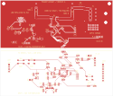
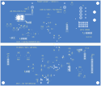
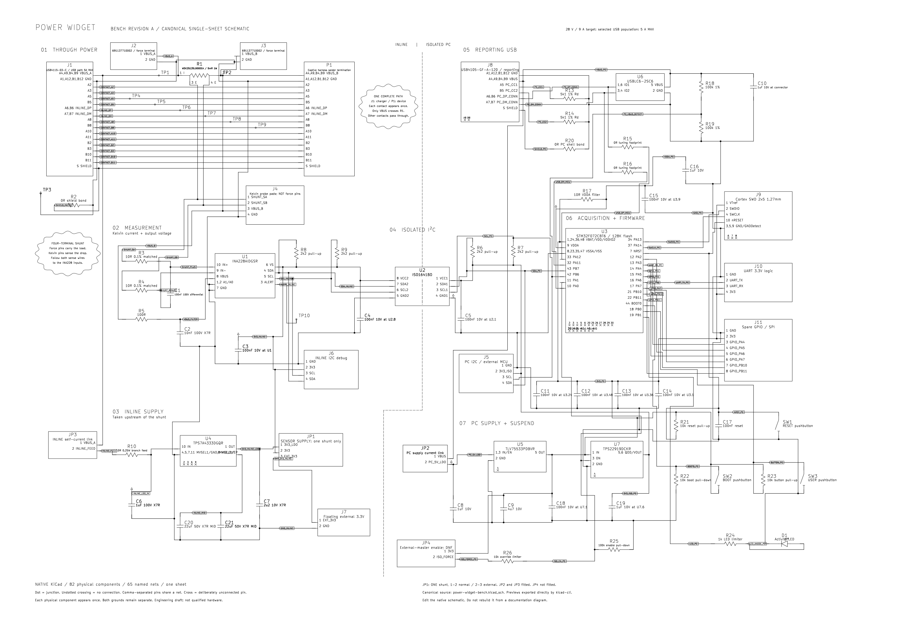

# Bench revision A — native schematic and PCB

**28 V / 9 A continuous design target, 10.8 A design margin. No physical assembly is qualified.** This is the accessible prototype for connector experiments, calibration and MCU firmware development. It contains the complete proposed sensing, reporting, supply and debug circuits rather than a separate continuity fixture.

Open [power-widget-bench.kicad_pro](power-widget-bench.kicad_pro) in KiCad 9. The project includes the [native schematic](power-widget-bench.kicad_sch), [editable PCB](power-widget-bench.kicad_pcb), project symbols, and a snapshot of all 23 used footprint types. Native checks report **zero [ERC violations](erc.rpt), [DRC violations, unconnected items and schematic/PCB mismatches](drc.rpt)**. Read the [layout review](../../docs/layout-review.md) for board status and release gates. There are no fabrication-release Gerbers.

## PCB views

These are actual 2D plots exported from the checked-in KiCad PCB. No 3D assembly render or physical prototype photograph is available yet.



[Open top view](pcb-top.svg) — front copper with front silkscreen and outline.

<details>
<summary>Show bottom copper view</summary>



[Open bottom copper view](pcb-bottom.svg) — bottom copper with front silkscreen and outline, **viewed from the top**. This is not a mirrored bottom assembly drawing.

</details>

## Circuit drawings

### Single-sheet schematic

[](single-sheet.svg)

[Native SVG export](single-sheet.svg) · [A2 PDF](single-sheet.pdf) · [Editable schematic](power-widget-bench.kicad_sch) · [Native checks](single-sheet-check.json)

**This is the canonical KiCad schematic, not a separately drawn diagram.** The SVG and PDF are direct `kicad-cli` exports. The README PNG is only a white-background rasterization of that SVG so it remains readable in light and dark themes. The [earlier layout mockup](layout-mockup.svg) is retained as a reference, explicitly not the design authority. The former five-sheet schematic is superseded and remains available in Git history.

The force path runs left to right through R1, with its Kelvin measurement branch directly beneath it. Every J1 and P1 contact is visible in its **one complete connector symbol**. Isolated I²C crosses the marked boundary into the PC-powered reporting circuit. Cloud callouts explain the through path and the shunt's separate force and sense terminals. Every connection is wired continuously; net labels annotate those wires once per net. Dots mean junctions; undotted crossings are not connected. Unconnected pin numbers and their no-connect crosses appear inside the relevant packages. There are no off-sheet connections or split component units in this version.

KiCad reports **82 physical components, 65 named nets, 288 connected numbered pins and 30 unconnected numbered pins**. Six additional nonphysical power flags stay in the native schematic for ERC. The [migration comparison](native-migration-check.json) verifies unchanged pin/net connectivity, values, footprints and component UUIDs against the previous native design. PCB edits only flatten the 82 schematic association paths; copper, placement and all other PCB content are unchanged. Native [ERC](erc.rpt), [DRC and schematic/PCB parity](drc.rpt) pass with zero violations or unconnected items.

**Edit `power-widget-bench.kicad_sch` in KiCad.** The local `Bench.kicad_sym` library contains editable native symbol geometry; symbols are also embedded in the schematic. Reference, Value and Footprint are native fields. The auxiliary Domain, Section, CircuitKind, SourceFootprint and Notes fields supply metadata for the JSON and component-schedule exports. The historical JSON `sheet` field now identifies a functional placement group, not a separate schematic sheet.

The normal workflow flows in one direction: **native schematic → native netlist / JSON / schedule / SVG / PDF / PNG**. Neither export script writes a schematic, library or PCB. There is no separate Python circuit definition that can overwrite edits made in KiCad.

```sh
python tools/capture_bench.py             # export JSON and component schedule from KiCad
python tools/draw_flat_schematic.py       # run ERC/DRC/parity and export drawings
python tools/capture_bench.py --check     # verify native data exports are current
python tools/draw_flat_schematic.py --check
```

Use KiCad 9.0.9 and librsvg (`rsvg-convert`) to reproduce the checked-in exports. `KICAD_CLI` can name a local CLI executable. If no local KiCad CLI is found, the tools use Docker and the pinned [official KiCad container](https://gitlab.com/kicad/packaging/kicad-docker) for 9.0.9 in [kicad_native.py](../../tools/kicad_native.py); only the project directory is mounted, and the container runs as the invoking user without network access. `KICAD_DOCKER_IMAGE` can select another installed image. The SVG check ignores only KiCad's export timestamp; the PDF, PNG and native reports have recorded hashes. Print the PDF at A2 or enlarge it, or zoom the vector files on screen.

These are CAD consistency results, not hardware qualification. The existing component, connector and fabrication gates still apply.

## Bench arrangement

The bench PCB is **125 × 107 mm**, four layers, with a candidate 2 oz outer / 1 oz inner stack. The force path runs across the upper portion. The PC receptacle sits on the bottom long edge, and a 3 mm copper keepout separates PC and inline domains across every layer. U2 bridges the gap; the ground plane is split by domain. This is functional isolation, not a certified insulation rating. Fabricator capability, thermal behavior and USB signal integrity require qualification.

J1 is the selected GCT inline receptacle; P1 is the board-side solder termination for a custom captive harness. Its individual contact wiring is defined in [connector-routing.md](../../docs/connector-routing.md). All CC-contact, SBU and SuperSpeed contact paths are retained; only USB 2.0 data performance is in scope. No inline PD controller, new e-marker, or charger-identification termination is fitted. The selected GCT USB population is limited to **5 A**. See [connector selection](../../docs/connector-selection.md); the 9 A USB assembly remains unsourced. Final product topology remains open.

| Access | Connections / use |
|---|---|
| J2 / J3 | Two-pin force connections: 1 = VBUS_A / VBUS_B, 2 = GND_INLINE. Electrically parallel with USB ports; use qualified terminals and short heavy leads. |
| J4 | 1 = upstream shunt Kelvin, 2 = downstream shunt Kelvin, 3 = PCB_B voltage, 4 = quiet inline ground. Sense only. |
| TP4 / TP5 | Separate A5 / B5 contact probes. Use suitable high-impedance, low-capacitance isolated probes; no grounded PC wire. |
| J5 | PC-side I²C: 1 = GND_PC, 2 = switched 3.3 V reference, 3 = SCL, 4 = SDA. External open-drain master supported with U3 held in reset and JP4 fitted. |
| J6 | Inline I²C: 1 = GND_INLINE, 2 = 3V3_INLINE, 3 = SCL, 4 = SDA. Floating instruments only. |
| J7 | Floating external supply: 1 = 3.3 V input, 2 = GND_INLINE. Current limit for initial bring-up; never tie to PC ground. |
| J9 | Cortex 10-pin SWD, 1.27 mm, keyed pin 7 absent. Pin 1 is target-voltage reference; pin 6 has no SWO. |
| J10 | 3.3 V UART: 1 = GND_PC, 2 = board TX, 3 = board RX, 4 = supply reference. |
| J11 | GPIO: GND_PC, 3V3_PC, PA4, PA5, PA6, PA7, PB10, PB11 in pin order. |

Header supply pins are references/outputs except the explicitly identified J7 input. External debug probes must not inject supply power. Grounded bench supplies, scopes and electronic loads can externally join the domains even when the board itself is isolated.

## Jumpers and power accounting

| Link | Normal state | Bench purpose |
|---|---|---|
| JP1 | One shunt on 1–2 | Selects inline LDO. Move the single shunt to 2–3 for floating external J7 supply; never fit both. |
| JP2 | Fitted | Replace with an ammeter to characterize PC-domain consumption. Input capacitor, ESD and VBUS divider are ahead of this link; use a USB input-current measurement for total PC-port draw. |
| JP3 | Fitted | Replace with a floating ammeter to measure the inline regulator/sensor branch. R10 remains in circuit. |
| JP4 | Not fitted | Forces isolator PC supply on for an external I²C master. Remove for normal firmware/suspend testing. R26 limits conflict with PA1. |

U4 derives sensor power from VBUS_A before the shunt. JP3 measures the main self-consumption branch; output-sense loading remains a separate small burden. The current 8 mA allocation is **not** a measured correction. Characterize actual draw over voltage, activity and temperature, including the measuring instrument's burden. See [energy comparison](../../docs/energy-comparison.md).

U7 switches U2 side 1 and its pull-ups using MCU PA1. The ISO1641 side-1 high-state maximum is 3.2 mA at 3.3 V, so simply sleeping the MCU would leave an excessive suspend burden. Before disabling U7, firmware releases PB6/PB7 and removes internal pull-ups; resume enables the rail and waits for settling before I²C. This circuit addresses the identified load; total USB suspend current still needs measurement.

## Bring-up sequence on this board

1. Close the documented PCB/connector/protection release gates, then inspect the assembly unpowered. Verify PC/inline isolation, both independent CC paths and no supply shorts. Leave OEM equipment disconnected.
2. Power J8 only. Establish 3V3_PC, reset/boot/SWD and USB enumeration. Verify PA1 can switch the isolator rail and that suspend removes its load. Sensor absence is a valid diagnostic state.
3. Use current-limited floating 3.3 V at J7 with JP1 on 2–3. Verify INA228 ID, raw readings, calibration commands and logging while VBUS is zero. This permits firmware work before an inline charger is attached.
4. Apply current-limited 5 V through qualified J2/J3 force wiring and a small known load. Verify polarity, the B voltage reference, one-second statistics and energy. Return JP1 to 1–2 and repeat with normal sensor power. Compare the JP3 measurement with the supply budget.
5. Sweep voltage and load for calibration. Increase core current toward 9 A only with rated force connections, monitored temperatures and an appropriately limited supply/load. The 10.8 A point needs an explicit continuous-capacity thermal test; it is not a brief survival pulse.
6. Qualify the actual captive assembly electrically and thermally, then compare direct versus inserted OEM charging across all orientations. Keep the controlled bench at known ≤28 V until overrange handling is resolved.

## Before PCB release

J1 and the force terminals now have selected parts and footprints; P1 has a board-side captive-harness termination. The shunt's four terminals and native pad/net mapping have been reviewed. Complete the orderable BOM, passive voltage/power and capacitor bias/stability review, actual captive assembly and strain relief. The selected USB parts remain limited to 5 A; sourcing a qualified 9 A USB assembly is a separate open gate.

Review the routed board against the fabricator's stack, copper weight, fine clearances and USB impedance requirements. Resolve inline ESD/overrange protection without compromising CC or low-power leakage. Review unpowered behavior, USB timing/current and regulator thermals; physical tests must establish measurement accuracy, current capacity and charging compatibility. See the [layout](../../docs/layout-review.md), [connector](../../docs/connector-selection.md) and [protection](../../docs/protection-review.md) reviews for the remaining work.

Export circuit data from the native schematic with `python tools/capture_bench.py`; use `--check` to detect stale exports. Its assertions check independent CC nets, no shared PC/inline nets and the MCU supply pins. These checks do not replace ERC, impedance/thermal layout work or hardware tests.

## Physical-design reproduction

With KiCad 9 Python `pcbnew` available:

```sh
python tools/capture_bench.py
python tools/footprint_bench.py
python tools/layout_bench.py
python tools/fanout_bench.py
# Route the generated DSN with a compatible Specctra router; use one optimization thread.
python tools/finish_bench.py --session hardware/bench-rev-a/power-widget-bench.ses
# The retained session requires these reviewed manual repairs:
python tools/review_route_bench.py
python tools/finish_bench.py
kicad-cli sch erc --exit-code-violations -o hardware/bench-rev-a/erc.rpt hardware/bench-rev-a/power-widget-bench.kicad_sch
kicad-cli pcb drc --schematic-parity --exit-code-violations -o hardware/bench-rev-a/drc.rpt hardware/bench-rev-a/power-widget-bench.kicad_pcb
```

`layout_bench.py` rebuilds the initial placement and constrained power routes; it overwrites the PCB. Preserve hand edits before regenerating. The checked-in PCB is the review artifact. The routing session and reports record subsequent routing/review, not hardware test results. Set `KICAD_FOOTPRINT_DIR` when the KiCad library is outside `/usr/share/kicad/footprints`. See [footprint provenance](footprint-provenance.md), [connector selection](../../docs/connector-selection.md), and [protection review](../../docs/protection-review.md).

Current native results: **ERC 0; DRC 0; unconnected items 0; schematic/PCB parity mismatches 0.** These are CAD results, not a current/voltage or charging-compatibility rating. [Top PCB view](pcb-top.svg) · [Bottom copper view](pcb-bottom.svg).
